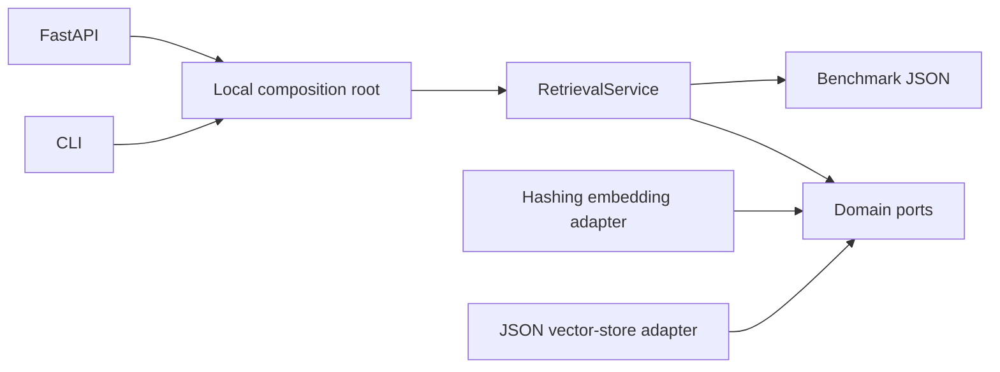

# #3 rag-knowledge-base

**Claim:** Local-first RAG knowledge base with deterministic vector retrieval, FastAPI serving, and reproducible Recall@k benchmark.

**Benchmark:** Recall@3 = `1.00`, average query latency = `1.65 ms`, p95 query latency = `1.97 ms`, cost/query = `$0.000000` on the included 8-document fixture.

## What It Proves

This repository proves a focused RAG retrieval layer:

- JSONL ingestion, deterministic local hashing embeddings, and persisted vector search
- per-question Recall@k as `recovered relevant / total relevant`
- five complete benchmark repetitions and 35 timed query samples
- use cases injected with embedding and vector-store ports
- FastAPI paths confined to configured data and result roots
- CLI and Docker execution without paid secrets or model downloads

The included fixture is intentionally small. Recall@3 = 1.00 proves that the local pipeline and metric contract execute correctly on this fixture; it is not evidence of production retrieval quality.

## Architecture



The application layer imports domain ports only. CLI and FastAPI select the local adapters through `infrastructure/composition.py`, so another embedding or vector store can replace them without changing retrieval policy.

## Run Locally

```powershell
python -m pip install -e ".[test]"
python -m rag_knowledge_base ingest
python -m rag_knowledge_base query "How is recall at k measured for vector search?" --top-k 3
python -m rag_knowledge_base evaluate --repetitions 5 --output benchmarks/results/retrieval-baseline.json
python -m unittest discover -s tests -v
```

Without an editable install, set `PYTHONPATH=src` before the Python commands.

## Run With Docker

```powershell
docker build -t rag-knowledge-base .
docker run --rm -p 8000:8000 rag-knowledge-base
```

API docs are available at `http://localhost:8000/docs`.

Generate a persistent benchmark result from Docker:

```powershell
$resultDir = (Resolve-Path benchmarks/results).Path
docker run --rm -v "${resultDir}:/results" rag-knowledge-base evaluate --repetitions 5 --output /results/retrieval-baseline.json
```

## API File Boundary

API callers provide relative paths only. Corpus, questions, and index paths resolve below `RAG_DATA_ROOT` (default `data`); benchmark outputs resolve below `RAG_RESULT_ROOT` (default `benchmarks/results`). Absolute paths, `..` traversal, and paths escaping through symlinks are rejected with HTTP 400.

The CLI is a trusted local interface and may receive explicit local paths.

## Benchmark Result

| Metric | Value | Unit |
|---|---:|---|
| recall_at_3 | 1.00 | ratio |
| avg_latency_ms | 1.65 | ms |
| p95_latency_ms | 1.97 | ms |
| cost_per_query_usd | 0.000000 | USD |
| repetitions | 5 | runs |
| timed_query_samples | 35 | queries |

Each repetition evaluates all seven questions. Recall@k is computed for each question as the number of relevant documents recovered in the top k divided by that question's total relevant documents; the primary metric is the macro mean across questions and repetitions. Seven warm-up queries are excluded from latency samples.

Result file: `benchmarks/results/retrieval-baseline.json`. Environment: Python 3.12.13 in the Linux Docker image on Docker Desktop/WSL2.

## Dataset

- `corpus.jsonl`: 8 small documents about RAG and repository engineering.
- `questions.jsonl`: 7 questions; one has two relevant documents to exercise fractional Recall@k.

## Design Decisions

- Deterministic hashing embeddings keep the baseline offline and free.
- Qdrant and model-backed embeddings remain future adapters, not default dependencies.
- REST/HTTP fits the command-oriented API; GraphQL adds no value to this proof.
- No broker is used because ingestion, query, and evaluation are synchronous.

## Validation

```powershell
powershell -ExecutionPolicy Bypass -File tools/validate-project.ps1
```

## References

See `REFERENCES.md`.
