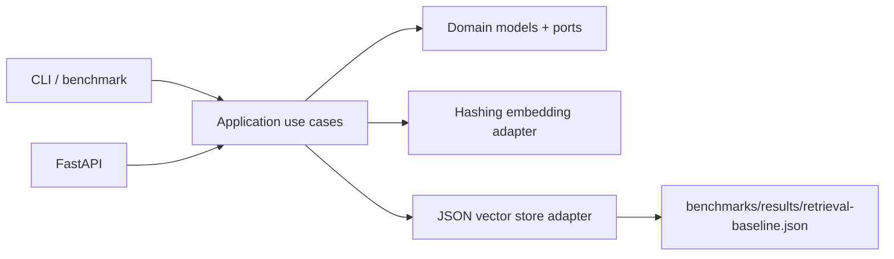

# #3 rag-knowledge-base

**Claim:** Local-first RAG knowledge base with deterministic vector retrieval, FastAPI serving, and reproducible Recall@k benchmark.

**Benchmark:** Recall@3 = `1.00`, average query latency = `18.90 ms`, p95 query latency = `30.76 ms`, cost/query = `$0.000000` on the included 8-document fixture.

## What It Proves

This repository proves a RAG retrieval layer from first principles:

- document ingestion from JSONL fixtures
- deterministic local hashing embeddings
- vector search with dot-product similarity
- extractive grounded context response
- FastAPI `/ingest`, `/query`, `/evaluate` endpoints
- CLI benchmark that writes portfolio-compatible JSON
- no paid secret or external model download in the default path

## Architecture



Dependency rule: domain and application code do not import FastAPI, Uvicorn, cloud SDKs, broker SDKs, or vector database SDKs.

## Run Locally

```powershell
$env:PYTHONPATH = "src"
python -m rag_knowledge_base ingest
python -m rag_knowledge_base query "How is recall at k measured for vector search?" --top-k 3
python -m rag_knowledge_base evaluate --output benchmarks/results/retrieval-baseline.json
```

## Run With Docker

```powershell
docker build -t rag-knowledge-base .
docker run --rm -p 8000:8000 rag-knowledge-base
```

API docs are available at `http://localhost:8000/docs`.

Run the benchmark in Docker:

```powershell
docker run --rm rag-knowledge-base evaluate --output /tmp/retrieval-baseline.json
```

## Benchmark Result

| Metric | Value | Unit |
|---|---:|---|
| recall_at_3 | 1.00 | ratio |
| avg_latency_ms | 18.90 | ms |
| p95_latency_ms | 30.76 | ms |
| cost_per_query_usd | 0.000000 | USD |

Result file: `benchmarks/results/retrieval-baseline.json`.

## Dataset

The fixture lives in `data/fixtures/`:

- `corpus.jsonl`: 8 small documents about RAG, vector search, local-first cloud, benchmarking, FastAPI, ports/adapters, reuse loop, and hashing embeddings.
- `questions.jsonl`: 7 retrieval questions with expected relevant document ids.

## Design Decisions

- Default embeddings are deterministic local hashing vectors to keep the demo reproducible and free.
- Qdrant and sentence-transformers are intentionally not required in the first benchmark; they are future adapters behind the same retrieval boundary.
- REST/HTTP is enough for the API shape; GraphQL would add complexity without improving the benchmark.
- No broker is used because ingestion and evaluation are synchronous in the baseline.

## Validation

```powershell
powershell -ExecutionPolicy Bypass -File tools/validate-project.ps1
```

Fast local loop:

```powershell
$env:PYTHONPATH = "src"
python -m compileall -q src tests
python -m unittest discover -s tests -v
python -m rag_knowledge_base evaluate --output benchmarks/results/retrieval-baseline.json
```

## References

See `REFERENCES.md`.
