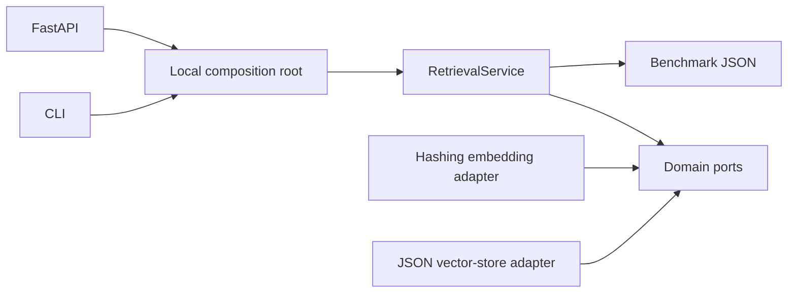

# RAG Knowledge Base: Clean-Architecture Retrieval Layer with Reproducible Evaluation

**Recall@3 = `1.00`** with p95 query latency `0.4474 ms` on the bundled fixture, served through FastAPI and evaluated reproducibly. Embedding model and vector store sit behind ports, so they can be swapped without touching retrieval policy.

[](https://github.com/Brilhante29/rag-knowledge-base/actions/workflows/validate.yml)
[](LICENSE)


## Why this exists

Most RAG demos glue an embedding API to a vector database and call it done. When answers go wrong, nobody can tell whether retrieval or generation failed, and the vendor choice is baked into every layer. This repository builds the retrieval half the way it should be built before an LLM is added:

- domain ports for embeddings and vector storage, with local adapters chosen in one composition root;
- per-question Recall@k (`recovered relevant / total relevant`), so a question with two relevant documents can score `0.5`;
- an API that resolves only relative paths under configured roots and rejects traversal and symlink escapes with HTTP 400;
- an `export-eval-artifact` command that emits a versioned prediction contract, consumed by [llm-eval-harness](https://github.com/Brilhante29/llm-eval-harness) without importing this code.

It runs offline with deterministic hashing embeddings: no paid API, no model download, no secret.

## Results

| Metric | Value | Unit |
|---|---:|---|
| recall_at_3 | 1.00 | ratio |
| avg_latency_ms | 0.3174 | ms |
| p95_latency_ms | 0.4474 | ms |
| cost_per_query_usd | 0.000000 | USD |
| repetitions | 5 | runs |
| timed_query_samples | 35 | queries |

Five complete repetitions with 35 timed query samples; seven warm-up queries are excluded. The primary metric is the macro mean of per-question Recall@3.

The fixture is intentionally tiny (8 documents, 7 questions), so a perfect recall proves the pipeline and metric contract, not production retrieval quality. Swapping in a neural embedding adapter, as compared in [embeddings-benchmark](https://github.com/Brilhante29/embeddings-benchmark), is the intended next step.

## Quickstart

```bash
docker build -t rag-knowledge-base .
docker run --rm -p 8000:8000 rag-knowledge-base
# interactive API docs: http://localhost:8000/docs
```

Local CLI:

```bash
python -m pip install -e ".[test]"
python -m rag_knowledge_base ingest
python -m rag_knowledge_base query "How is recall at k measured for vector search?" --top-k 3
python -m rag_knowledge_base evaluate --repetitions 5 --output benchmarks/results/retrieval-baseline.json
python -m unittest discover -s tests -v
```

Publication evidence with Docker provenance: `python tools/benchmark_v2.py`.

## How it works


```mermaid
flowchart LR
  CLI["CLI"] --> Composition["Local composition root"]
  API["FastAPI"] --> Composition
  Composition --> Service["RetrievalService"]
  Service --> Ports["Domain ports"]
  Embed["Hashing embedding adapter"] --> Ports
  Store["JSON vector-store adapter"] --> Ports
  Service --> Result["Benchmark JSON"]
```

| Layer | Contents |
|---|---|
| `domain/` | Models and the `EmbeddingProvider` / `VectorStore` ports |
| `application/` | Chunking and retrieval use cases, depending on ports only |
| `infrastructure/` | Hashing embeddings, JSON vector store, composition root |
| `interfaces/` | FastAPI and CLI adapters |

## Design decisions

| Decision | Why | Rejected for now |
|---|---|---|
| Clean architecture with ports | Retrieval policy must outlive the vendor choice | Framework-first code calling a vendor SDK everywhere |
| Deterministic hashing embeddings | Offline, free, bit-reproducible baseline | Paid embedding APIs as a default dependency |
| JSON vector store | Enough for the fixture, trivially inspectable | Qdrant or pgvector before scale demands it |
| REST over HTTP | Command-oriented operations | GraphQL (no flexible-read need here) |
| Synchronous pipeline | Ingest, query, and evaluate are request-scoped | A message broker |

## Limitations

- Retrieval only: no LLM generation, reranking, or answer grounding check in this repository.
- Hashing embeddings capture token overlap, not semantics.
- The fixture is too small to rank retrieval strategies; it validates correctness and contracts.

## Reproducibility

- Raw result: [`benchmarks/results/retrieval-baseline.json`](benchmarks/results/retrieval-baseline.json).
- Publication result with source commit, image digest, lock digest, and CI provenance: [`benchmarks/publication/retrieval-baseline-v2.json`](benchmarks/publication/retrieval-baseline-v2.json).
- Dataset: `data/fixtures/corpus.jsonl` (8 documents) and `data/fixtures/questions.jsonl` (7 questions, one with two relevant documents).

## Project structure

```text
src/rag_knowledge_base/   domain, application, infrastructure, interfaces
tests/                    retrieval and API boundary tests
data/                     corpus and evaluation questions
benchmarks/               raw results and V2 publication evidence
tools/                    V2 producer and validators
sdd/  openspec/           specification, architecture and technical decisions
```

## How this repository is built

The project follows the spec-driven workflow of [portfolio-reuse-kit](https://github.com/Brilhante29/portfolio-reuse-kit). Requirements and decisions live in [`sdd/`](sdd) and [`openspec/`](openspec), and [`project.yaml`](project.yaml) records the architecture, stack, and rejected alternatives. Development is AI-assisted and human-governed: [`AGENTS.md`](AGENTS.md) and [`CLAUDE.md`](CLAUDE.md) hold the coding-agent instructions, while tests, validators, and CI decide what gets published.

## Related work

- [llm-eval-harness](https://github.com/Brilhante29/llm-eval-harness): evaluates the predictions this repository exports.
- [embeddings-benchmark](https://github.com/Brilhante29/embeddings-benchmark): neural embedding models compared under one port.
- [prompt-ab-testing](https://github.com/Brilhante29/prompt-ab-testing) and [llm-agent-eval](https://github.com/Brilhante29/llm-agent-eval): the generation and agent side.

See [`REFERENCES.md`](REFERENCES.md) for attribution.

## Author

**Guilherme Brilhante**, software engineer working on scalable backends and production AI.
[LinkedIn](https://www.linkedin.com/in/guilhermefreirebrilhanteseveriano/) · [GitHub](https://github.com/Brilhante29) · [Publications](https://dblp.org/pid/353/6812.html)

## License

[MIT](LICENSE).
